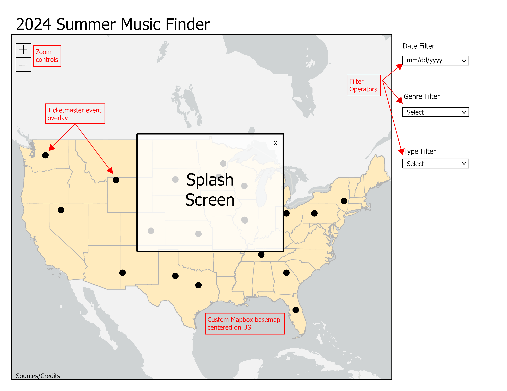

# Summer Music Finder
## GEOG-575 Spring 2024 Final Project
### Team Members
1. Morgan
2. Lindsay McClintock
### Final Proposal Requirements
1. Project Summary
2. Persona/Scenario
3. Requirements Document
    i. Representation
    ii. Interaction
4. Wireframes

---
## 1. Project Summary
The 2024 Summer Music Finder is tool to help music lovers find events happening across the US this summer. The map displays events from the Ticketmaster API and provides real-time access to the concerts and festivals happening in 2024. 

## 2. Persona/Scenario
A user of this application could be classified as a "Music Lover." The Music Lover is someone who likes to spend their summer going to music festivals and concerts. They are interested in music of all types and will use the map to zoom in to their home and explore the events near them. Since they love all music, they may be more concerned with finding events on days they are available. They can use the date selector and the popup information to learn more about the event and get tickets.

Another user is only interested in one genre of music. Like the Music Lover, they want to spend their summer listening to music, but they only want to hear their style of music. This user is willing to travel a little farther to see their favorites, no matter what day. The genre-specific user will use the genre filter to find events and then use the popup to learn more and get their tickets. 

## 3. Requirements Document

### i. Representation

|Layer | Source | Description |
| --- | --- | --- |
| Basemap of US | Mapbox Studio | Custom basemap design with Mapbox Studio |
| Music events | https://developer.ticketmaster.com/products-and-docs/apis/getting-started/#available-resources | Custom record icons design in Adobe Illustrator |

### ii. Interaction

| Title | Operator and Operand | Description |
| --- | --- | --- |
| Genre Filter | Filter music events | A dropdown menu with various genres to filter events |
| Type Filter | Filter music events | A dropdown menu to filter events by type - fesitval or concert |
| Date Filter | Filter music events | A calendar filter events by date |
| Popup | Retrieve music events | Popup information for each event with band, date, location and ticket link |
| Zoom | Zoom basemap and overlays | Zoom in and out |

## 4. Wireframes

